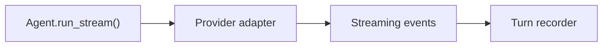

# Pull Request Guidelines

This skill owns pull request operating logic, including summary prose. Pair with
`content-styleguide` for deeper revision: clarity, word choice, voice, tone,
and AI-artifact cleanup.

## Communication Contract

A pull request body is addressed first to a specific reader: the reviewer. It is
also a durable review interface that should help future maintainers recover the
author's mental model without turning review into a checklist.

It should communicate:

- what changed;
- why the change exists;
- what context, constraint, or decision shaped it;
- what is settled, uncertain, or intentionally out of scope;
- where risk is concentrated, if that changes how the reviewer should read;
- where reviewer attention is useful;
- what a future maintainer should be able to trace from the PR record.

Keep the pull request body durable. Use comments for live dialogue,
negotiation, open-ended reviewer-role questions, or follow-up coordination.

## Review Posture

Review posture is a review aid, not the core contract. Use it when naming the
kind of attention needed will help the reviewer.

Common postures:

- correctness check;
- design critique;
- boundary review;
- migration review;
- live testing;
- verification;
- QA;
- merge readiness;
- follow-up issue capture.

Suggest the posture without over-controlling the reviewer. If the reviewer may
need to define their own responsibility, invite that in a PR comment rather than
the durable summary.

## Workflow

1. Read the current PR title, body, base, head, and changed files.
2. Identify what the PR needs to communicate: change, intent, context, author
   judgment, review surface, and future traceability.
3. Decide whether the PR body is enough or whether the change needs a separate
   review guide comment.
4. Draft the PR body as a durable record first, then add reviewer guidance only
   where it changes the review.
5. For complex, high-risk, or tacit-context-heavy work, treat the first draft as
   a proposal for human refinement rather than a final automation product.
6. Pair with `content-styleguide` before handing off final prose when the output
   is human-facing and needs deeper revision.

## Feedback Conduct

Treat review feedback as part of the pull request conversation. Acknowledge
straightforward feedback with an appropriate thumbs-up or thumbs-down reaction.
Leave a reply when the reviewer needs context, when the response is not obvious,
or when the author disagrees.

When a revision responds to feedback, push the change before resolving the
comment or review thread. Do not resolve feedback that is still unanswered,
unimplemented, or blocked on a decision.

## Summary Shape

Open with what changed. If the opener has two jobs, split it into two short
paragraphs: one for what changed, one for why it matters.

Use only the sections the diff earns:

- `Changed` for reviewer-scannable scope.
- `Context` for design docs, internal docs, discussions, related PRs, or
  roadmap entries that affect review.
- `Risk Surface` for the concrete areas where the change could fail.
- `Review Focus` for suggested reviewer attention.
- `Verified` only when specific evidence changes reviewer trust.

Do not include ritual `Tested`, `Validation`, or `Not Tested` sections when CI
already covers the meaningful test surface, the change is prose-only, or the
commands do not map to a specific risk.

## Summary Prose

A PR summary helps a human reviewer understand the change fast enough to review
it well. Respect the reader's time: give them the point, the shape of the diff,
and the verification evidence without making them decode a template.

Every PR summary opens with one clear sentence that says what the PR does. Name
the behavioral or structural result, not the editing activity.

Strong:

> Adds adapter-backed session persistence so callers can swap SQL and in-memory
> storage without changing agent code.

Weak:

> This PR updates persistence files and adds tests.

After that sentence, choose only the structure the diff earns. A small bug fix
may need two short paragraphs. A broad refactor may need headings, a reading
path, and a test matrix. Never make reviewers scan empty ritual sections.

Good PR summaries answer the questions the diff raises:

- What changes for users, callers, or maintainers?
- Why is this change necessary now?
- Where should the reviewer start?
- Does another PR explain, block, or depend on this one?
- What is intentionally out of scope?
- What was verified?
- What risk remains?

If the answer is obvious from the code, cut it. If the reviewer might guess
wrong, include it.

## Related PRs

Reference another PR when the relationship changes how this PR should be read.
Name the relationship, not just the link.

Useful:

> Builds on #214, which introduced the repository protocols. Review this PR for
> adapter wiring, not the protocol shape.

Also useful:

> Split from #219 so the streaming event contract can be reviewed before the
> Pydantic AI translation layer.

Reference related PRs when one of these is true:

- This PR depends on, unblocks, supersedes, or replaces another PR.
- The work was split from a larger PR and reviewers need the boundary.
- A prior PR contains the design decision this PR implements.
- Review order matters.
- The PR touches the same area and reviewers may otherwise re-litigate context.

Do not link PRs that are merely nearby in time or topic. A reference should save
the reviewer a wrong turn, not prove project history.

## Shape by Diff Size

Small PR:

```markdown
Fixes token totals for failed turns so session summaries still include usage
from the attempted model request.

- Treats failed-turn usage the same as succeeded-turn usage during aggregation.
- Adds a regression test for transient provider errors.

Tested: `pytest tests/harness/test_tokens.py`
```

Medium PR:

```markdown
Moves persistence behind repository adapters so the system can support SQL and
in-memory storage through one session handler.

**Why**
The old session handler knew about SQLAlchemy models directly, which made test
storage and future adapters inherit SQL assumptions.

**Changed**

- Adds `PersistenceAdapter` as the bundle of session, turn, and message
  repositories.
- Replaces direct model access in `DefaultSessionHandler`.
- Updates tests to run against the in-memory adapter.

**Tested**

- `pytest tests/harness/persistence`
- `make typecheck`
```

Complex PR:

```markdown
Introduces framework-agnostic streaming events so `Agent.run_stream()` can
persist completed turns while callers consume provider-neutral deltas.

**Reading Path**
Start with `src/harness/types/streaming.py` for the event contract, then read
`src/harness/mixin.py` for lifecycle handling. The provider adapter changes are
mostly translation glue after that.

**Design Notes**

- Streaming events are ephemeral; only the final `AgentTurn` is persisted.
- `stream.result` is unavailable until iteration completes, matching the
  existing `run()` result shape.
- Durable agents still use `run()` because durable streaming needs a separate
  checkpointing design.

**Review Focus**

- Event ordering and naming.
- Cancellation behavior in `AgentTurnStreamResult.__aexit__`.
- Whether adapter-specific details leak into harness types.

**Tested**

- `pytest tests/harness/test_streaming.py`
- `pytest tests/adapters/test_streaming.py`
- Manual cancellation check with a fake streaming model
```

Use Markdown as a reading aid, not decoration. Bullets are for peer items,
numbered lists are for ordered steps or reading paths, tables are for values
that share columns, and headings are only useful when they reduce scanning cost.

Review guidance should point to decision-bearing files, risky boundaries, or the
order that makes the diff make sense. Do not apologize for size or explain
GitHub.

## Risk Surfaces

For complex or high-risk pull requests, name the specific surfaces where the
change could fail. Prefer concrete boundaries over generic risk language:
lifecycle ordering, data migration, permissions, security, concurrency,
backward compatibility, rollout, observability, external integrations, or UX
state.

Include a compact `Risk Surface` section in the PR body when the risk map is
part of the durable record. Move detailed risk routing into a review guide
comment when different reviewers need different paths or when the risk
discussion would make the summary too procedural.

Explain both what is risky and what is intentionally lower risk or out of scope.
Do not add a generic risk section that only says the change is low, medium, or
high risk.

## Review Guide Comments

Create a standalone PR review guide comment for complex or high-risk changes
when the PR body would become too procedural. Good triggers:

- architecture or design decisions need critical engagement;
- multiple reviewers need different review paths;
- risk is concentrated in a boundary, migration, security path, data model, or
  rollout sequence;
- external docs or discussions define constraints reviewers should apply;
- non-blocking feedback should become follow-up issues instead of blocking
  merge;
- the reviewer may need to define their own review responsibility.

Keep the summary durable. Put dialogue, negotiation, and review-role invitations
in the comment.

For review guide comment structure and examples, read
`references/review-guides.md`.

## External Context

Link only context that changes review. Name the relationship, not just the
document.

Example links in this section use reserved placeholder URLs. Do not invent
realistic internal URLs that a later agent could treat as project context.

<external-context-example>
Implements the event contract from
[Streaming events architecture](https://github.com/example-org/example-repo/blob/main/docs/architecture/streaming-events.md).
Review this pull request for adapter behavior, not event taxonomy.
</external-context-example>

## Changed File Links

When a PR body or review guide points the reviewer to a changed file, prefer a
GitHub PR file-diff link over a relative path in code spans. The file link
should continue to work as commits are added to the PR as long as the file stays
in the diff under the same path.

Use this shape:

<changed-file-link-format>
https://github.com/<org>/<repo>/pull/<number>/files#diff-<sha256-of-file-path>
</changed-file-link-format>

Use the exact changed-file path when computing the SHA-256 anchor. Do not use a
commit-specific blob permalink when the link should follow later PR commits.
Use a commit permalink only when the reviewer needs a frozen line reference.

Before publishing or updating a PR body, scan `Changed`, `Review Focus`, and
review guide comments for code-spanned changed-file paths. Convert navigation
targets into PR file-diff links; leave code spans only when the path is acting
as prose or a literal identifier.

## Diagrams

Use Mermaid diagrams when a reviewer needs flow, ownership, state transitions,
dependency direction, or rollout order before reading the diff. Keep diagrams
small and tied to the review boundary.



## What To Cut

- Restating every changed file.
- Full test logs when command names and outcomes are enough.
- Test sections that duplicate CI without explaining a PR-specific risk.
- Link lists that do not explain how the linked document changes review.
- Diagrams that restate the obvious or sprawl beyond the review boundary.
- Review instructions that deny the reviewer room to choose their approach.
